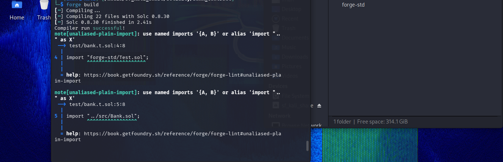
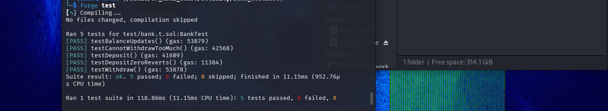

# 🏦 Bank Smart Contract (Foundry)

A simple Ethereum smart contract that allows users to **deposit, withdraw, and track ETH balances**, built using Solidity and tested with Foundry.

---

## 📌 Overview

This project demonstrates core smart contract concepts:

- Handling ETH transfers
- Managing balances using mappings
- Writing secure withdrawal logic
- Testing contracts using Foundry

---

## ⚙️ Features

- Deposit ETH  
- Withdraw ETH  
- Check user balance  
- Prevent over-withdrawal  
- Revert on invalid operations  
- Fully tested using Foundry  

---

## 🧱 Smart Contract

### `Bank.sol`

```solidity
function deposit() external payable  
```
Allows users to send ETH to the contract.
```
function withdraw(uint amount) external
```
Withdraw ETH with balance check and safe transfer.
```
function getBalance(address user) external view returns (uint)
```
Returns the balance of a user.

## 🧪 Testing (Foundry)

### Bank.t.sol

Test cases:

- User can deposit ETH  
- User can withdraw ETH  
- Cannot withdraw more than balance  
- Balance updates correctly  
- Revert works properly  

---

## 📸 Screenshots

### 🔹 Forge Build


### 🔹 Forge Test


---

## 🛠️ Tech Stack

- Solidity  
- Foundry  
- Git & GitHub  

---

## 🚀 Getting Started

### Clone the repository

```bash
git clone https://github.com/your-username/bank-contract.git
cd bank-contract
